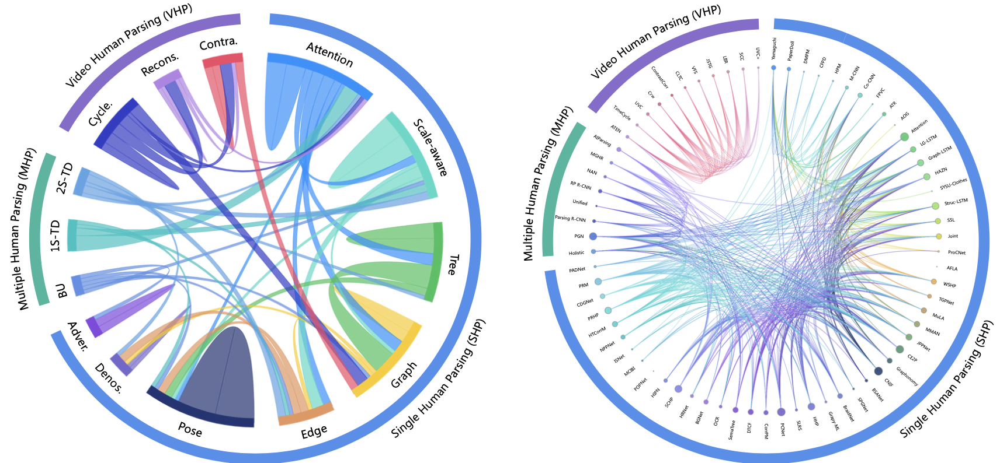

## 3 Deep Learning based Human Parsing

The existing human parsing can be categorized into three sub-tasks: single human parsing, multiple human parsing, and video human parsing, focusing on parts relationship modeling, human instance discrimination, and temporal correspondence learning, respectively.

### 3.1 Single Human Parsing Models

| Year | Method | Pub.        | Paper Title                                                                                                                                                                                     |                                                               Project                                                               |
|------|:------:|:-----------:|-------------------------------------------------------------------------------------------------------------------------------------------------------------------------------------------------|:-----------------------------------------------------------------------------------------------------------------------------------:|
| 2012 | Yamaguchi|  CVPR     | [Parsing clothing in fashion photographs](https://ieeexplore.ieee.org/stamp/stamp.jsp?tp=&arnumber=6248101)|--|
| 2013 | DMPM   |    ICCV     | [A deformable mixture parsing model with parselets](https://ieeexplore.ieee.org/stamp/stamp.jsp?tp=&arnumber=6751535)|--|
| 2013 | PaperDoll|  ICCV     | [Paper doll parsing: Retrieving similar styles to parse clothing items](https://ieeexplore.ieee.org/stamp/stamp.jsp?tp=&arnumber=6751549)|--|
| 2013 | CFPD   |    TMM      | [Fashion parsing with weak color-category labels](https://ieeexplore.ieee.org/stamp/stamp.jsp?tp=&arnumber=6630093)|--|
| 2014 | HPM    |    CVPR     | [Towards unified human parsing and pose estimation](https://ieeexplore.ieee.org/stamp/stamp.jsp?tp=&arnumber=6909508)|--|
| 2015 | M-CNN  |    CVPR     | [Matching-cnn meets knn: Quasi-parametric human parsing](https://ieeexplore.ieee.org/stamp/stamp.jsp?tp=&arnumber=7298748)|--|
| 2015 | Co-CNN |    ICCV     | [Human parsing with contextualized convolutional neural network](https://ieeexplore.ieee.org/stamp/stamp.jsp?tp=&arnumber=7423822)|[Project](https://github.com/lemondan/HumanParsing-Dataset/)|
| 2015 | FPVC   |    TMM      | [Fashion parsing with video context](https://ieeexplore.ieee.org/stamp/stamp.jsp?tp=&arnumber=7120998)|--|
| 2015 | ATR    |    TPAMI    | [Deep human parsing with active template regression](https://arxiv.org/pdf/1503.02391)|--|
| 2016 | AOG    |    AAAI     | [Pose-guided human parsing by an and/or graph using pose-context features](https://arxiv.org/pdf/1508.03881)|--|
| 2016 | Attention|  CVPR     | [Attention to scale: Scale-aware semantic image segmentation](https://ieeexplore.ieee.org/stamp/stamp.jsp?tp=&arnumber=7780765)|[Code](http://liangchiehchen.com/projects/DeepLab.html)|
| 2016 | LG-LSTM|    CVPR     | [Semantic object parsing with local-global long short-term memory](https://ieeexplore.ieee.org/stamp/stamp.jsp?tp=&arnumber=7780716)|--|
| 2016 | Graph-LSTM| ECCV     | [Semantic object parsing with graph lstm](https://arxiv.org/pdf/1603.07063)|--|
| 2016 | HAZN   |    ECCV     | [Zoom better to see clearer: Human and object parsing with hierarchical auto-zoom net](https://arxiv.org/pdf/1511.06881)|--|
| 2016 | SYSU-Clothes|TMM     | [Clothes coparsing via joint image segmentation and labeling with application to clothing retrieval](https://ieeexplore.ieee.org/stamp/stamp.jsp?tp=&arnumber=7434660)|[Project](http://vision.sysu.edu.cn/projects/clothing-co-parsing/)|
| 2017 | Struc-LSTM| CVPR     | [Interpretable structure-evolving lstm](https://arxiv.org/pdf/1703.03055)|--|
| 2017 | SSL    |    CVPR     | [Look into person: Self-supervised structure-sensitive learning and a new benchmark for human parsing](https://arxiv.org/pdf/1703.05446v2)|[Code](https://github.com/Engineering-Course/LIP_SSL/), [Project](http://hcp.sysu.edu.cn/lip)|
| 2017 | Joint  |    CVPR     | [Joint multi-person pose estimation and semantic part segmentation](https://ieeexplore.ieee.org/stamp/stamp.jsp?tp=&arnumber=8100127)|--|
| 2018 | ProCNet|    AAAI     | [Progressive cognitive human parsing](https://www.aaai.org/ocs/index.php/AAAI/AAAI16/paper/download/12206/12140)|--|
| 2018 | AFLA   |    AAAI     | [Cross-domain human parsing via adversarial feature and label adaptation](https://arxiv.org/pdf/1801.01260)|--|
| 2018 | WSHP   |    CVPR     | [Weakly and semi supervised human body part parsing via pose-guided knowledge transfer](https://arxiv.org/pdf/1805.04310.pdf)|--|
| 2018 | TGPNet |    MM       | [Trusted guidance pyramid network for human parsing](https://dl.acm.org/doi/pdf/10.1145/3240508.3240634)|[Code](https://github.com/suzhuoi/TGPnet)|
| 2018 | MuLA   |   ECCV      | [Mutual learning to adapt for joint human parsing and pose estimation](https://openaccess.thecvf.com/content_ECCV_2018/papers/Xuecheng_Nie_Mutual_Learning_to_ECCV_2018_paper.pdf)|--|
| 2018 | MMAN   |    ECCV     | [Macromicro adversarial network for human parsing](https://arxiv.org/pdf/1807.08260)|[Code](https://github.com/RoyalVane/MMAN)|
| 2018 | JPPNet |    TPAMI    | [Look into person: Joint body parsing pose estimation network and a new benchmark](https://ieeexplore.ieee.org/stamp/stamp.jsp?tp=&arnumber=8327922)|[Project](http://www.sysu-hcp.net/lip/)|
| 2019 | CE2P   |    AAAI     | [Devil in the details: Towards accurate single and multiple human parsing](https://arxiv.org/pdf/1809.05996.pdf)|[Code](https://github.com/liutinglt/CE2P)|
| 2019 | Graphonomy| CVPR     | [Graphonomy: Universal human parsing via graph transfer learning](https://arxiv.org/pdf/1904.04536)|[Code](https://github/)|
| 2019 | CNIF   |    ICCV     | [Learning compositional neural information fusion for human parsing](https://arxiv.org/pdf/2001.06804)|[Code](https://github.com/ZzzjzzZ/CompositionalHumanParsing)|
| 2019 | BSANet |    ICCV     | [Multi-class part parsing with joint boundary-semantic awareness](https://ieeexplore.ieee.org/stamp/stamp.jsp?tp=&arnumber=9010738)|--|
| 2019 | SPGNet |    ICCV     | [Spgnet: Semantic prediction guidance for scene parsing](https://openaccess.thecvf.com/content_ICCV_2019/papers/Cheng_SPGNet_Semantic_Prediction_Guidance_for_Scene_Parsing_ICCV_2019_paper.pdf)|--|
| 2019 | BraidNet|   MM       | [Braidnet: Braiding semantics and details for accurate human parsing](https://dl.acm.org/doi/pdf/10.1145/3343031.3350857)|--|
| 2020 | Grapy-ML|   AAAI     | [Grapy-ml: Graph pyramid mutual learning for cross-dataset human parsing](https://arxiv.org/pdf/1911.12053.pdf)|[Code](https://github.com/Charleshhy/Grapy-ML)|
| 2020 | HHP    |    CVPR     | [Hierarchical human parsing with typed part-relation reasoning](https://arxiv.org/pdf/2003.04845)|[Code](https://github.com/hlzhu09/Hierarchical-Human-Parsing)|
| 2020 | SLRS   |    CVPR     | [Self-learning with rectification strategy for human parsing](https://ieeexplore.ieee.org/stamp/stamp.jsp?tp=&arnumber=9157112)|--|
| 2020 | PCNet  |    CVPR     | [Part-aware context network for human parsing](https://ieeexplore.ieee.org/stamp/stamp.jsp?tp=&arnumber=9156966)|--|
| 2020 | CorrPM |    CVPR     | [Correlating edge, pose with parsing](https://openaccess.thecvf.com/content_CVPR_2020/papers/Zhang_Correlating_Edge_Pose_With_Parsing_CVPR_2020_paper.pdf)|[Code](https://github.com/ziwei-zh/CorrPM)|
| 2020 | DTCF   |    MM       | [Hybrid resolution network using edge guided region mutual information loss for human parsing](https://dl.acm.org/doi/pdf/10.1145/3394171.3413831)|--|
| 2020 | SemaTree|   ECCV     | [Learning semantic neural tree for human parsing](https://arxiv.org/pdf/1912.09622.pdf)|[Code](https://isrc.iscas.ac.cn/gitlab/research/sematree)|
| 2020 | OCR    |    ECCV     | [Object-contextual representations for semantic segmentation](https://www.ecva.net/papers/eccv_2020/papers_ECCV/papers/123510171.pdf)|[Code](https://git.io/openseg), [Code](https://git.io/HRNet.OCR)|
| 2020 | BGNet  |    ECCV     | [Blended grammar network for human parsing](https://www.ecva.net/papers/eccv_2020/papers_ECCV/papers/123690188.pdf)|--|
| 2020 | HRNet  |    TPAMI    | [Deep high-resolution representation learning for visual recognition](https://ieeexplore.ieee.org/stamp/stamp.jsp?tp=&arnumber=9052469)|[Code](https://github.com/HRNet)|
| 2020 | SCHP   |    TPAMI    | [Self-correction for human parsing](https://arxiv.org/pdf/1910.09777)|[Code](https://github.com/PeikeLi/Self-Correction-Human-Parsing)|
| 2021 | HIPN   |    AAAI     | [Hierarchical information passing based noise-tolerant hybrid learning for semi-supervised human parsing](https://www.aaai.org/AAAI21Papers/AAAI-2890.LiuYunan.pdf)|--|
| 2021 | POPNet |    AAAI     | [Progressive one-shot human parsing](https://arxiv.org/pdf/2012.11810)|[Code](https://github.com/Charleshhy/One-shot-Human-Parsing)|
| 2021 | MCIBI  |    ICCV     | [Mining contextual information beyond image for semantic segmentation](https://openaccess.thecvf.com/content/ICCV2021/papers/Jin_Mining_Contextual_Information_Beyond_Image_for_Semantic_Segmentation_ICCV_2021_paper.pdf)|[Code](https://github.com/CharlesPikachu/)|
| 2021 | ISNet  |    ICCV     | [Isnet: Integrate image-level and semantic-level context for semantic segmentation](https://openaccess.thecvf.com/content/ICCV2021/papers/Jin_ISNet_Integrate_Image-Level_and_Semantic-Level_Context_for_Semantic_Segmentation_ICCV_2021_paper.pdf)|[Code](https://github.com/SegmentationBLWX)|
| 2021 | NPPNet |    ICCV     | [Neural architecture search for joint human parsing and pose estimation](https://openaccess.thecvf.com/content/ICCV2021/papers/Zeng_Neural_Architecture_Search_for_Joint_Human_Parsing_and_Pose_Estimation_ICCV_2021_paper.pdf)|[Code](https://github.com/GuHuangAI/NPP)|
| 2021 | HTCorrM|    TPAMI    | [On the correlation among edge, pose and parsing](https://ieeexplore.ieee.org/stamp/stamp.jsp?tp=&arnumber=9527074)|--|
| 2021 | PRHP   |    TPAMI    | [Hierarchical human semantic parsing with comprehensive part-relation modeling](https://ieeexplore.ieee.org/stamp/stamp.jsp?tp=&arnumber=9340561)|[Code](https://github.com/hlzhu09/Hierarchical-Human-Parsing)|
| 2021 | CDGNet |    CVPR     | [Cdgnet: Class distribution guided network for human parsing](https://arxiv.org/pdf/2111.14173.pdf)|[Code](https://github.com/tjpulkl/CDGNet)|
| 2022 | HSSN   |    CVPR     | [Deep hierarchical semantic segmentation](https://ieeexplore.ieee.org/stamp/stamp.jsp?tp=&arnumber=9878466)|[Code](https://github.com/0liliulei/HieraSeg)|
| 2022 | PRM    |    TMM      | [Human parsing with part-aware relation modeling](https://ieeexplore.ieee.org/stamp/stamp.jsp?tp=&arnumber=9706337)|--|
| 2022 | PADNet |    TPAMI    | [From pose to part: Weakly-supervised pose evolution for human part segmentation](https://ieeexplore.ieee.org/stamp/stamp.jsp?tp=&arnumber=9772949)|--|

### 3.2 Multiple Human Parsing Models

| Year | Method | Publication | Paper Title                                                                                                                                                                                     |                                                               Project                                                               |
|------|:------:|:-----------:|-------------------------------------------------------------------------------------------------------------------------------------------------------------------------------------------------|:-----------------------------------------------------------------------------------------------------------------------------------:|
| 2017 | Holistic|   BMVC     | [Holistic, instance-level human parsing](https://arxiv.org/pdf/1709.03612)|--|
| 2018 | PGN    |    ECCV     | [Instance-level human parsing via part grouping network](https://openaccess.thecvf.com/content_ECCV_2018/papers/Ke_Gong_Instance-level_Human_Parsing_ECCV_2018_paper.pdf)|[Code](http://sysu-hcp.net/lip/)|
| 2019 | CE2P   |    AAAI     | [Devil in the details: Towards accurate single and multiple human parsing](https://arxiv.org/pdf/1809.05996.pdf)|[Code](https://github.com/liutinglt/CE2P) |
| 2019 | Parsing R-CNN| CVPR  | [Parsing R-CNN for instance-level human analysis](https://ieeexplore.ieee.org/stamp/stamp.jsp?tp=&arnumber=8953214)|[Code](https://github.com/soeaver/Parsing-R-CNN)|
| 2019 | BraidNet|   MM       | [Braidnet: Braiding semantics and details for accurate human parsing](http://xinchenliu.com/papers/2019_ACMMM_BraidNet.pdf)|-- |
| 2019 | Unified|    BMVC     | [A top-down unified framework for instance-level human parsing](https://faculty.ucmerced.edu/mhyang/papers/bmvc2019_human_parsing.pdf)|-- |
| 2020 | RP R-CNN|   ECCV     | [Learning semantic neural tree for human parsing](https://arxiv.org/pdf/1912.09622v1.pdf)|[Code](https://isrc.iscas.ac.cn/gitlab/research/sematree) |
| 2020 | SemaTree|   ECCV     | [Renovating parsing r-cnn for accurate multiple human parsing](https://arxiv.org/pdf/2009.09447)|[Code](https://github.com/soeaver/RP-R-CNN) |
| 2020 | NAN    |    IJCV     | [Fine-grained multi-human parsing](https://link.springer.com/content/pdf/10.1007/s11263-019-01181-5.pdf)|[Code](https://github.com/ZhaoJ9014/Multi-Human-Parsing_MHP) |
| 2020 | SCHP   |    TPAMI    | [Self-correction for human parsing](https://arxiv.org/pdf/1910.09777)|[Code](https://github.com/PeikeLi/Self-Correction-Human-Parsing) |
| 2021 | MGHR   |    CVPR     | [Differentiable multi-granularity human representation learning for instance-aware human semantic parsing](https://openaccess.thecvf.com/content/CVPR2021/papers/Zhou_Differentiable_Multi-Granularity_Human_Representation_Learning_for_Instance-Aware_Human_Semantic_Parsing_CVPR_2021_paper.pdf)|[Code](https://github.com/tfzhou/MG-HumanParsing) |
| 2022 | AIParsing|  TIP      | [Aiparsing: Anchor-free instance-level human parsing](https://ieeexplore.ieee.org/stamp/stamp.jsp?tp=&arnumber=9866618)|-- |

### 3.3 Video Human Parsing Models

| Year | Method | Publication | Paper Title                                                                                                                                                                                     |                                                               Project                                                               |
|------|:------:|:-----------:|-------------------------------------------------------------------------------------------------------------------------------------------------------------------------------------------------|:-----------------------------------------------------------------------------------------------------------------------------------:|
| 2018 | ATEN   |    MM       | [Adaptive temporal encoding network for video instance-level human parsing](https://dl.acm.org/doi/10.1145/3240508.3240660)|-- |
| 2019 | TimeCycle|  CVPR     | [Learning correspondence from the cycle-consistency of time](https://arxiv.org/pdf/1903.07593)|[Code](http://ajabri.github.io/timecycle) |
| 2019 | UVC    |    NeurIPS  | [Joint-task self-supervised learning for temporal correspondence](https://arxiv.org/pdf/1909.11895)|-- |
| 2020 | CRW    |    NeurIPS  | [Space-time correspondence as a contrastive random walk](https://arxiv.org/pdf/2006.14613)|-- |
| 2021 | ContrastCorr| AAAI   | [Contrastive transformation for self-supervised correspondence learning](https://arxiv.org/pdf/2012.05057)|[Code](https://github.com/594422814/ContrastCorr) |
| 2021 | CLTC   |    CVPR     | [Mining better samples for contrastive learning of temporal correspondence](https://openaccess.thecvf.com/content/CVPR2021/papers/Jeon_Mining_Better_Samples_for_Contrastive_Learning_of_Temporal_Correspondence_CVPR_2021_paper.pdf)|-- |
| 2021 | VFS    |    ICCV     | [Rethinking self-supervised correspondence learning: A video frame-level similarity perspective](https://arxiv.org/pdf/2103.17263)|[Code](https://jerryxu.net/VFS) |
| 2021 | JSTG   |    ICCV     | [Modelling neighbor relation in joint space-time graph for video correspondence learning](https://openaccess.thecvf.com/content/ICCV2021/papers/Zhao_Modelling_Neighbor_Relation_in_Joint_Space-Time_Graph_for_Video_Correspondence_ICCV_2021_paper.pdf)|-- |
| 2022 | LIIR   |    CVPR     | [Locality-aware inter-and intra-video reconstruction for self-supervised correspondence learning](https://ieeexplore.ieee.org/stamp/stamp.jsp?tp=&arnumber=9879494)|[Code](https://github.com/lingorX/LIIR) |
| 2022 | SCC    |    CVPR     | [Contrastive learning for space-time correspondence via self-cycle consistency](https://ieeexplore.ieee.org/stamp/stamp.jsp?tp=&arnumber=9878462)|-- |
| 2022 | UVC+   |    ArXiv    | [Transfer of representations to video label propagation: implementation factors matter](https://arxiv.org/pdf/2203.05553)|-- |

