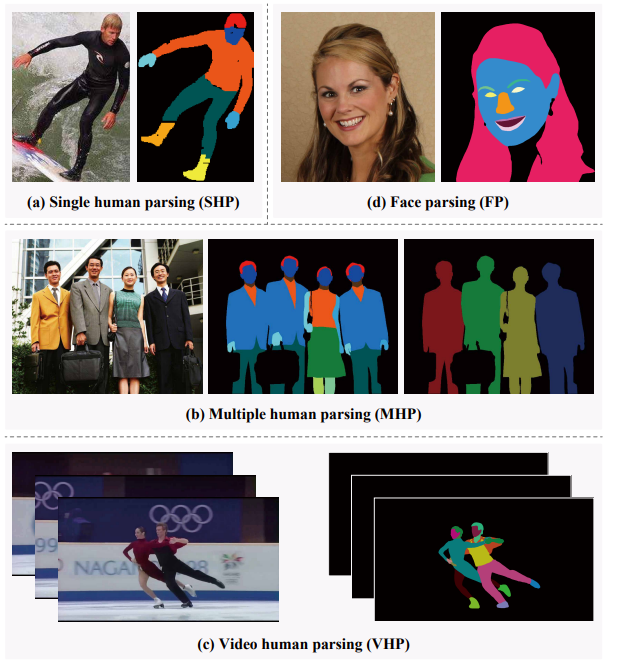

# Deep Learning Technique for Human Parsing: A Survey and Outlook

> [Deep Learning Technique for Human Parsing: A Survey and Outlook]() <br>
> [Yang Lu](https://). <br>
> [](https://)

## Contributing 

Please feel free to create issues or pull requests to add papers.

## 1. Introduction
Human parsing, considered as the fundamental task of human-centric visual analysis, which aims to classify the human parts and clothing accessories in images or videos at pixel-level. Numerous studies have been conducted on human parsing due to its crucial role in widespread application areas, e.g. security monitoring, autonomous driving, social media, fashion media, electronic commerce, visual special effects, artistic creation, etc, giving birth to various excellent human parsing methods and applications. 


<p align="center">
  
</p>


## 3.  Deep Learnign Based Human Parsing
- [3.1 Single Human Parsing Models](https://github.com/soeaver/awesome-human-parsing/blob/main/3-HP.md#31-Single-Human-Parsing-Models)
- [3.2 Multiple Human Parsing Models](https://github.com/soeaver/awesome-human-parsing/blob/main/3-HP.md#32-Multiple-Human-Parsing-Models)
- [3.3 Video Human Parsing Models](https://github.com/soeaver/awesome-human-parsing/blob/main/3-HP.md#33-Video-Human-Parsing-Models)
- [3.4 Face Parsing Models](https://github.com/soeaver/awesome-human-parsing/blob/main/3-HP.md#34-Face-Parsing-Models)

## 4. Datasets
- [4.1 SHP Datasets](https://github.com/soeaver/awesome-human-parsing/blob/main/4-Datasets.md#41-SHP-Datasets)
- [4.2 MHP Datasets](https://github.com/soeaver/awesome-human-parsing/blob/main/4-Datasets.md#42-MHP-Datasets)
- [4.3 VHP Datasets](https://github.com/soeaver/awesome-human-parsing/blob/main/4-Datasets.md#43-VHP-Datasets)
- [4.4 FP Datasets](https://github.com/soeaver/awesome-human-parsing/blob/main/4-Datasets.md#44-FP-Datasets)


## Citation

If you find our survey and repository useful for your research, please consider citing our paper:
```bibtex
@article{yang2022survey,
  title={Deep Learning Technique for Human Parsing: A Survey and Outlook},
  author={Lu Yang, Hongjie Liu, Wenhe Jia, Qing Song},
  journal={arXiv preprint arXiv:},
  year={2022}
}
```
