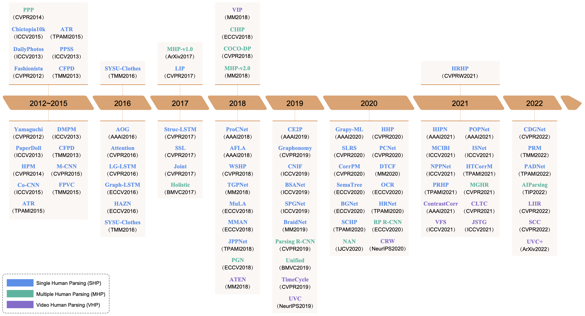
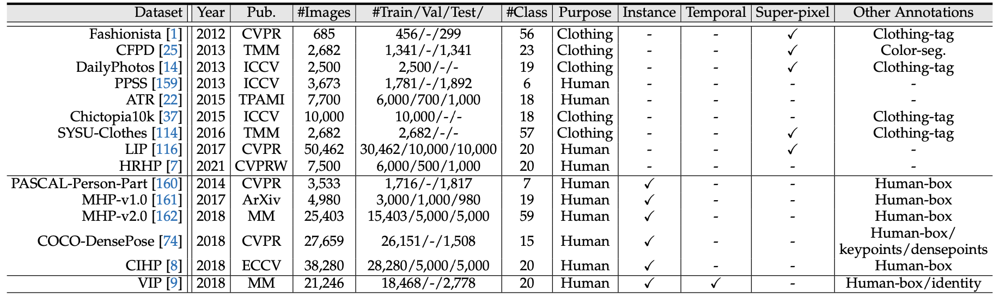
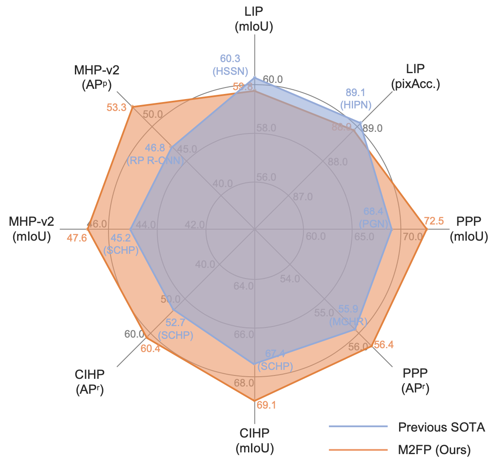

# Deep Learning Technique for Human Parsing: A Survey and Outlook

> [Deep Learning Technique for Human Parsing: A Survey and Outlook]() <br>
> [](https://arxiv.org/pdf/2301.00394.pdf)

If you find this repository helpful, please consider citing:

```BibTeX
@article{yang2024humanparsing,
  title={Deep Learning Technique for Human Parsing: A Survey and Outlook},
  author={Lu Yang and Wenhe Jia and Shan Li and Qing Song},
  journal={International Journal of Computer Vision},
  year={2024}
}
```


## Contributing 

Please feel free to create issues or pull requests to add papers.

## Updates

- **16.03.2024**: Our survey has been accepted to IJCV for publication!
- **27.05.2022**: We release paper on [ArXiv](https://arxiv.org/abs/2301.00394).
- **27.05.2022**: We release this GitHub repo.

## 1. Introduction
Human parsing aims to partition humans in image or video into multiple pixel-level semantic parts. In the last decade, it has gained significantly increased interest in the computer vision community and has been utilized in a broad range of practical applications, from security monitoring, to social media, to visual special effects, just to name a few. Although deep learning-based human parsing solutions have made remarkable achievements, many important concepts, existing challenges, and potential research directions are still confusing. In this survey, we comprehensively review three core sub-tasks: single human parsing, multiple human parsing, and video human parsing, by introducing their respective task settings, background concepts, relevant problems and applications, representative literature, and datasets. We also present quantitative performance comparisons of the reviewed methods on benchmark datasets. Additionally, to promote sustainable development of the community, we put forward a transformer-based human parsing framework, providing a high-performance baseline for follow-up research through universal, concise, and extensible solutions. Finally, we point out a set of under-investigated open issues in this field and suggest new directions for future study.

<p align="center"></p>


## 3.  Deep Learning Based Human Parsing

<p align="center"></p>

- [3.1 Single Human Parsing (SHP) Models](https://github.com/soeaver/awesome-human-parsing/blob/main/3-HP.md#31-Single-Human-Parsing-Models)
- [3.2 Multiple Human Parsing (MHP) Models](https://github.com/soeaver/awesome-human-parsing/blob/main/3-HP.md#32-Multiple-Human-Parsing-Models)
- [3.3 Video Human Parsing (VHP) Models](https://github.com/soeaver/awesome-human-parsing/blob/main/3-HP.md#33-Video-Human-Parsing-Models)

## 4. Human Parsing Datasets

<p align="center"></p>

- [4.1 Single Human Parsing (SHP) Datasets](https://github.com/soeaver/awesome-human-parsing/blob/main/4-Datasets.md#41-SHP-Datasets)
- [4.2 Multiple Human Parsing (MHP) Datasets](https://github.com/soeaver/awesome-human-parsing/blob/main/4-Datasets.md#42-MHP-Datasets)
- [4.3 Video Human Parsing (VHP) Datasets](https://github.com/soeaver/awesome-human-parsing/blob/main/4-Datasets.md#43-VHP-Datasets)


## A Transformer-based Baseline for Human Parsing

The proposed new baseline is based on the Mask2Former architecture, with only a few improvements adapted to human parsing, called Mask2Former for Parsing (M2FP).
M2FP achieves state-of-the-art or comparable performance across a broad range of human parsing benchmarks.

Architecture of M2FP:

<p align="center"></p>


Performance of M2FP:

<p align="center"></p>


More details see [M2FP](https://github.com/soeaver/M2FP).
